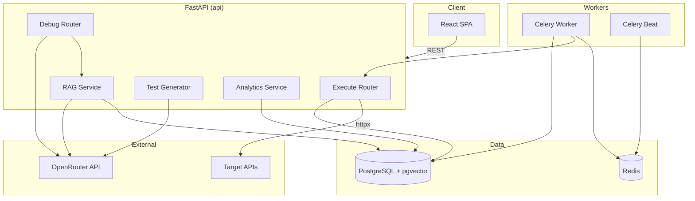

# Architecture — AI API Debugger

## Overview

A full-stack developer platform for API testing, scheduled monitoring, SQL analytics, RAG-augmented AI debugging, and automated test generation.



## Core Services

| Layer | Responsibility |
|-------|----------------|
| **HTTP Executor** | Runs requests via httpx, substitutes `{{env}}` variables, applies auth profiles |
| **Execution Service** | Persists runs, triggers RAG indexing on completion |
| **Analytics** | Raw SQL: P95 latency, success rate, time-bucketed aggregates |
| **Single-LLM Debug** | Cause + fix from failure context |
| **Multi-Agent Debug** | LangGraph pipeline: Diagnoser → Root-Cause → Fix-Suggester → Validator |
| **RAG** | Embeds run/debug text via OpenRouter, stores in pgvector, retrieves similar incidents |
| **Test Generator** | LLM or heuristic test cases (positive, negative, auth, edge) |
| **Monitoring** | Celery beat polls due schedules, worker executes and persists runs |

## Data Model

```
collections ──< api_requests ──< request_runs ──< debug_sessions
                     │                │
                     │                └──> log_embeddings (pgvector)
                     ├──< monitor_schedules
                     └──< generated_tests

environments (variables JSONB)
auth_profiles (reusable credentials)
```

## Request Flow — AI Debug with RAG

1. User selects a failed `request_run` or sends inline failure context.
2. `retrieve_similar()` embeds the query and runs cosine-distance search on `log_embeddings`.
3. Top-K similar past runs/sessions are injected into the LLM prompt.
4. Single or multi-agent analysis runs via OpenRouter.
5. Result saved to `debug_sessions`; session text indexed for future RAG.

## Deployment Modes

| Mode | Command | Frontend | API |
|------|---------|----------|-----|
| **Development** | `docker compose up --build` | Vite dev :5173 | Uvicorn reload :8010 |
| **Production** | `./deploy.sh` or `deploy.ps1` | nginx static :80 | Uvicorn 2 workers |

Production nginx proxies `/api/*` and `/health` to the internal API service. The SPA uses relative URLs (`VITE_API_URL=""`).

## Key Environment Variables

| Variable | Purpose |
|----------|---------|
| `OPENROUTER_API_KEY` | LLM + embeddings (required for AI/RAG) |
| `LLM_MODEL` | Chat model (default `openai/gpt-4o-mini`) |
| `EMBEDDING_MODEL` | Embedding model (default `openai/text-embedding-3-small`) |
| `RAG_ENABLED` | Toggle pgvector retrieval |
| `RAG_TOP_K` | Number of similar logs to inject |
| `DATABASE_URL` | PostgreSQL connection |
| `REDIS_URL` | Celery broker |

## API Surface (Days 16–30)

| Endpoint | Description |
|----------|-------------|
| `POST /api/execute` | Run HTTP request, persist run |
| `GET /api/analytics` | SQL dashboard metrics |
| `POST /api/debug/analyze` | Single-LLM debug |
| `POST /api/debug/multi-agent` | LangGraph pipeline |
| `GET /api/debug/sessions` | Paginated debug history |
| `POST /api/generate-tests` | Generate test cases |
| `GET /api/history/runs` | Paginated run history |
| `GET /api/history/debug-sessions` | Paginated debug sessions |
| `GET /api/history/monitors` | Paginated monitors |
